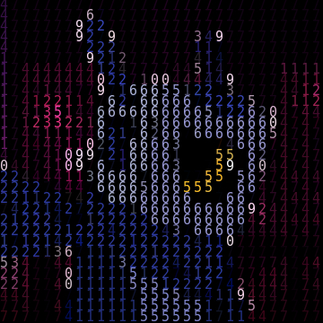

  
<a href="https://hosted.weblate.org/engage/kuba-lol/">
 
</a>

# 🤖 [kuba.lol](https://kuba.lol)
Welcome to the source code of my website - **kuba.lol**.  
It's pretty much just a static page with nothing fancy.  
The difference between this and other sites is that it **doesn't require JavaScript** - which is pretty common requirement for modern websites.  
## Script vs Non-script version
The only difference between non-script and script version of my website is that the script version has language switcher and automatic age calculation. Pretty much rest of the site should work flawlessly with no errors or visual issues.
## Translation
### Website supports translation! How to do it?
<a href="https://hosted.weblate.org/engage/kuba-lol/">
 
</a>

### Alternative method  
In the `src` folder you'll see `lang` directory, there are stored JSON files with translations. After finding it, it's pretty straightforward. Just copy one of the files and translate them to your language! **Keep in mind to look at context and not translate keys!** For example:
```
 \/ DON'T TRANSLATE THIS
"key": "value you want to translate"
              /\ TRANSLATE THIS
```
Remember to keep the format of file the same as the rest files have. Finish the file by saving it to the `lang` directory as `<lang>.json` where `<lang>` should be replaced with [appropriate language code from here](https://www.techonthenet.com/js/language_tags.php#currency_codes). This is so browser can automatically recognize the language and use it without user interaction.
## Credits
### Artists
- [LHS](https://www.youtube.com/@LHSchiptunes) - Reloaded Installer #10 song
### Generators/Tools
- [sokmontrey](https://github.com/sokmontrey) - Ascii Generated Avatar (https://imageascii.netlify.app/)
- [hermanTenuki](https://github.com/hermanTenuki) - Ascii Generated Logo (https://ascii-generator.site/)
### Translations
#### [Weblate Contributors](https://hosted.weblate.org/user/?q=%20contributes:kuba-lol)
#### Legacy Translators (pre-Weblate)
- **Nikola.567** ([TikTok](https://tiktok.com/@when_imposter_is_sus788)) - Verification of serbian AI generated translation.
- **Kartoffel_II** ([Twitter](https://x.com/Kartoffel_II)) - Verification and correction of german AI generated translation.
